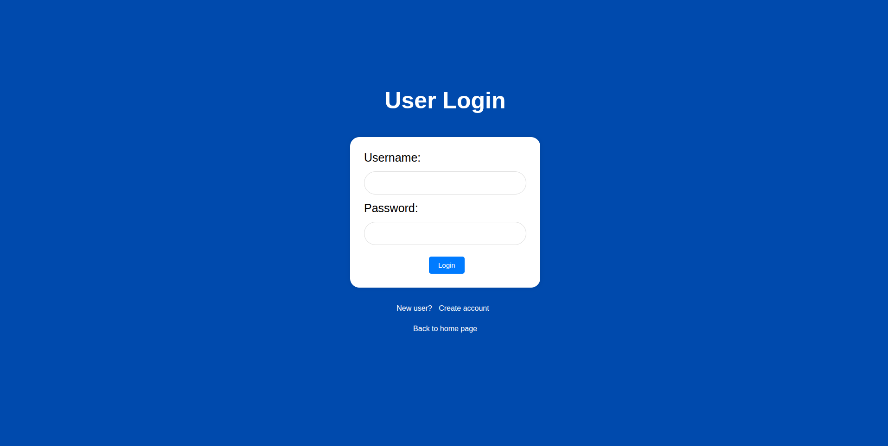
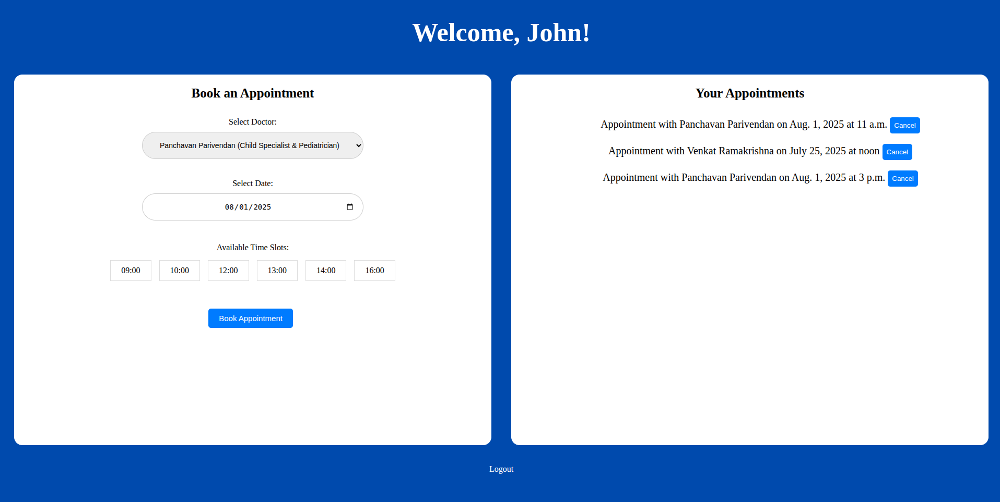
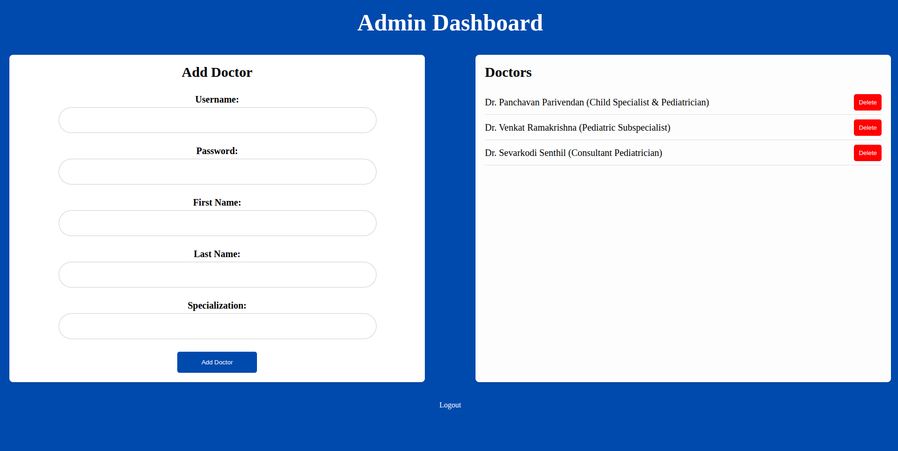
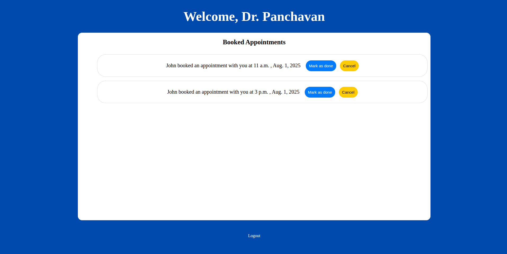

# appointment-system-for-hospital
## Overview
This project is a Django-based Hospital Appointment Management System that allows patients to book appointments, view doctors, and manage schedules efficiently for small to medium-sized clinics/hospitals.

## Features
- Patient registration and login
- Doctor registration and login
- Book, view, and cancel appointments
- Doctor can view and manage appointments
- Admin can manage doctors, patients, and appointments
- Basic authentication and session management

## Technologies Used
- Backend: Django (Python)
- Frontend: HTML, CSS
- Database: SQLite (can be swapped with PostgreSQL/MySQL in production)

## Setup Instructions
1. Clone the repository:
```
git clone https://github.com/vk2git/appointment-system-for-hospital.git
cd appointment-system-for-hospital-main
```
2. Create a virtual environment:
```terminal
python -m venv env
source env/bin/activate  # On Windows: env\\Scripts\\activate
```
3. Install dependencies:
```
pip install -r requirements.txt
```
3. Run migrations:
```
python manage.py migrate
```
3. Create a superuser for admin access:
```
python manage.py createsuperuser
```
3. Run the server:
```
python manage.py runserver
```

Access the application:
Open your browser and navigate to `http://127.0.0.1:8000/`.

Admin Panel:
Access at `http://127.0.0.1:8000/admin/` using the superuser credentials


## Project Preview Images

##### Landing page


##### User login page


##### User dashboard


##### Admin dashboard


##### Doctor dashboard


## Contributing
Feel free to fork and contribute by submitting issues or pull requests.

:)